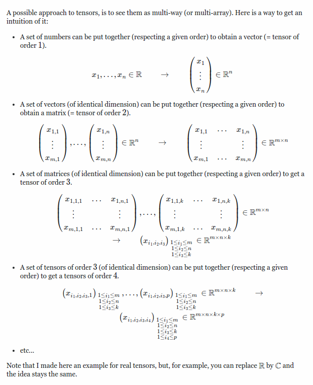
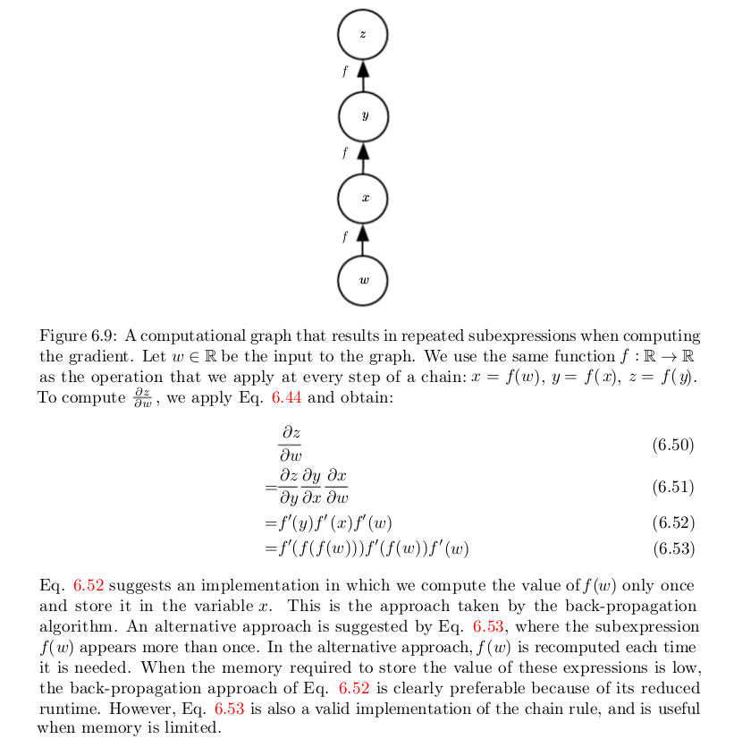
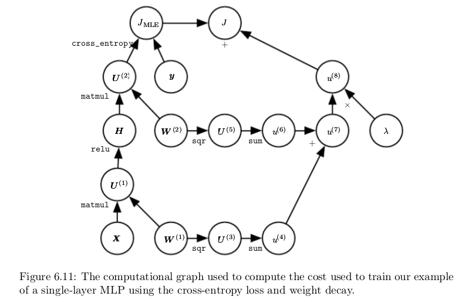

[TOC]

# Deep Feedforward Networks

Deep feedforward networks , also often called feedforward neural networks , or **multi-layer perceptrons \( MLPs \)**, are the quintessential deep learning models. The goal of a feedforward network is to approximate some function $$f^*$$ . For example, for a classifier, $$y = f^*(x)$$ maps an input x to a category y. A feedforward network defines a mapping y = f \(x; θ\) and learns the value of the parameters θ that result in the best function approximation.

Feedforward neural networks are called **networks** because they are typically represented by composing together many different functions. The model is associated with a directed acyclic graph describing how the functions are composed together. For example, we might have three functions $$f^{(1)}, f^{(2)}, f^{(3)}$$ connected in a chain, to form $$f(x) = f^{(1)}(f^{(2)}(f^{(3)}(x)))$$. These chain structures are the most commonly used structures of neural networks. In this case, f \(1\) is called the **first layer **of the network, f \(2\) is called the **second layer**, and so on. The overall length of the chain gives the **depth** of the model. It is from this terminology that the name “**deep learning**” arises. The final layer of a feedforward network is called the **output layer**. During neural network training, we drive f\(x\) to match $$f^*(x)$$. The training data provides us with noisy, approximate examples of $$f^*(x)$$ evaluated at different training points. Each example x is accompanied by a label $$y \approx f^*(x)$$. The training examples specify directly what the output layer must do at each point x; it must produce a value that is close to y. The behavior of the other layers is not directly specified by the training data. The learning algorithm must decide how to use those layers to produce the desired output, but the training data does not say what each individual layer should do. Instead, the learning algorithm must decide how to use these layers to best implement an approximation of f∗ . Because the training data does not show the desired output for each of these layers, these layers are called **hidden layers**. Finally, these networks are called **neural** because they are loosely inspired by neuroscience. Each hidden layer of the network is typically **vector-valued**. The dimensionality of these hidden layers determines the **width** of the model. Each element of the vector may be interpreted as playing a role analogous to a neuron. Rather than thinking of the layer as representing a single vector-to-vector function, we can also think of the layer as consisting of many **units** that act in parallel, each representing a vector-to-scalar function. Each unit resembles a neuron in the sense that it receives input from many other units and computes its own **activation val**ue. The idea of using many layers of vector-valued representation is drawn from neuroscience. The choice of the functions $$f^{(i)}(x)$$used to compute these representations is also loosely guided by neuroscientific observations about the functions that biological neurons compute. However, modern neural network research is guided by many mathematical and engineering disciplines, and the goal of neural networks is not to perfectly model the brain. It is best to think of feedforward networks as **function approximation machines **that are designed to achieve **statistical generalization**, occasionally drawing some insights from what we know about the brain, rather than as models of brain function.

To extend linear models to represent nonlinear functions of x, we can apply the linear model not to x itself but to a transformed input $$\phi(x)$$, where $$\phi$$ is a nonlinear transformation. We can think of $$\phi$$ as providing a set of **features** describing x, or as providing a new representation for x . The strategy of deep learning is to **learn **$$\phi$$. In this approach, we have a model $$y = f(x;\theta, w) = \phi(x;\theta)^Tw$$. We now have parameters θ that we use to learn $$\phi$$ from a broad class of functions, and parameters w that map from $$\phi(x)$$ to the desired output. This is an example of a deep feedforward network, with $$\phi$$** defining a hidden layer**. This approach gives up on the convexity of the training problem, but the benefits outweigh the harms. In this approach, we parametrize the representation as $$\phi(x; θ)$$and use the optimization algorithm to find the θ that corresponds to a good representation. If we wish, this approach can be highly **generic**—we do so by using a very broad family $$\phi(x; θ)$$. This approach can also let **human** practitioners encode their knowledge to help generalization by designing families $$\phi(x; θ)$$ that they expect will perform well. The advantage is that the human designer only needs to find the right general function family rather than finding precisely the right function.

They form the basis of many important commercial applications. For example, the **convolutional networks **used for object recognition from photos are a specialized kind of feedforward network.

When feedforward neural networks are extended to include feedback connections, they are called **recurrent neural networks, **which power many natural language applications.

## Learning XOR Function

The XOR function provides the target function $$y = f^*(x)$$ that we want to learn. Our model provides a function y = f\(x;θ \) and our learning algorithm will adapt the parameters θ to make f as similar as possible to $$f^*$$. In this simple example, we will not be concerned with statistical generalization. We want our network to perform correctly on the four points $$X = \{(0,0)^T, (0,1)^T, (1,0)^T, (1,1)^T \}$$. We will train the network on all four of these points. The only challenge is to fit the training set.

Clearly, we must use a **nonlinear function** to describe the features. Most neural networks do so using an **affine transformation controlled by learned parameters, followed by a fixed, nonlinear function called an activation function**. We use that strategy here, by defining $$h = g(W^Tx+c)$$, where W provides the weights of a linear transformation and c the biases. The activation function g is typically chosen to be a function that is applied element-wise, with $$h_i = g(x^TW_:i+c_i)$$. In modern neural networks, the default recommendation is to use the rectified linear unit or **ReLU,** defined by the activation function $$g(z) = max(0,z)$$.

The rectified linear activation function. This activation function is the default activation function recommended for use with most feedforward neural networks. Applying this function to the output of a linear transformation yields a nonlinear transformation. However, the function **remains very close to linear**, in the sense that is a piecewise linear function with two linear pieces. Because rectified linear units are nearly linear, they preserve many of the properties that make linear models** easy to optimize with gradient-based methods**. They also preserve many of the properties that make linear models generalize well. **A common principle throughout computer science is that we can build complicated systems from minimal components.** Much as a **Turing machine’s memory needs only to be able to store 0 or 1 states,** we** can build a universal function approximator from rectified linear functions.**

We can now specify our complete network for XOR function as $$f(x; W, c, w, b) = w^Tg((W^Tx+c))+b$$

## Gradient-Based Learning

The largest difference between the linear models we have seen so far and neural networks is that the nonlinearity of a neural network causes most interesting loss functions to become non-convex. This means that neural networks are usually trained by using **iterative, gradient-based optimizers** that merely **drive the cost function to a very low value**, rather than the linear equation solvers used to train linear regression models or the convex optimization algorithms with global convergence guarantees used to train logistic regression or SVMs. 

Convex optimization converges starting from any initial parameters (in theory—in practice it is very robust but can encounter numerical problems). **Stochastic gradient descent** applied to non-convex loss functions has no such convergence guarantee, and is **sensitive to the values of the initial parameters**. For feedforward neural networks, it is important to **initialize all weights to small random values**. The **biases may be initialized to zero or to small positive values**. 

### Cost Functions

#### Learning Conditional Distributions with Maximum Likelihood

The cost functions for neural networks are more or less the same as those for other parametric models, such as linear models. In most cases, our parametric model defines a **distribution p( y | x ;θ )** and we simply use the **principle of maximum likelihood.** This means we use the **cross-entropy** between the **training data** and the **model’s predictions** as the cost function. 

$$J(\theta) = -\mathbb{E}_{x,y \sim p_{data}} log p_{model} (y|x)$$ 

The specific form of the cost function changes from model to model, depending on the specific form of $$log p_{model}$$ . The expansion of the above equation typically yields some terms that do not depend on the model parameters and may be discarded. For example, if $$p_{model} (y | x ) = \mathcal{N}  (y; f(x; θ), I)$$, then we recover the mean squared error cost,

$J(\theta) = \frac {1} {2} \mathbb{E}_{x,y\sim \hat p_{data}}\|y-f(x,\theta)|^2 + const$

up to a scaling factor of 12 and a term that does not depend on θ . The discarded constant is based on the variance of the Gaussian distribution, which in this case we chose not to parametrize. Previously, we saw that the equivalence between maximum likelihood estimation with an output distribution and minimization of mean squared error holds for a linear model, but in fact, the <u>equivalence holds regardless of the f ( x ; θ ) used to predict the mean of the Gaussian.</u>

**An advantage of this approach of deriving the cost function from maximum likelihood is that it removes the burden of designing cost functions for each model. Specifying a model p(y | x ) automatically determines a cost function log p(y | x ).**

One recurring theme throughout neural network design is that the <u>gradient of the cost function must be large and predictable enough</u> to serve as a good guide for the learning algorithm. <u>Functions that saturate (become very flat) undermine this objective because they make the gradient become very small</u>. In many cases this happens because the **activation functions** used to produce the output of the hidden units or the output units saturate. <u>The negative log-likelihood helps to avoid this problem for many models.</u> Many output units involve an exp function that can saturate when its argument is very negative. **The log function in the negative log-likelihood cost function undoes the exp of some output units.** We will discuss the interaction between the cost function and the choice of output unit in Sec. 6.2.2 .

One unusual property of the cross-entropy cost used to perform maximum likelihood estimation is that it usually does not have a minimum value when applied to the models commonly used in practice. For discrete output variables, most models are parametrized in such a way that they cannot represent a probability of zero or one, but can come arbitrarily close to doing so. Logistic regression is an example of such a model. For real-valued output variables, if the model can control the density of the output distribution (for example, by learning the variance parameter of a Gaussian output distribution) then it becomes possible
to assign extremely high density to the correct training set outputs, resulting in cross-entropy approaching negative infinity. Regularization techniques described in Chapter 7 provide several different ways of modifying the learning problem so
that the model cannot reap unlimited reward in this way.

#### Learning Conditional Statistics

Instead of learning a full probability distribution p(y | x ; θ) we often want to learn just <u>one conditional statistic of y given x</u> .
For example, <u>we may have a predictor f (x; θ ) that we wish to predict the mean of y</u> .

If we use a sufficiently powerful neural network, we can think of the neural network as being able to represent any function f from a wide class of functions, with this class being limited only by features such as continuity and boundedness rather than by having a specific parametric form. From this point of view, we can view the cost function as being a **functional** rather than just a function. <u>A functional is a mapping from functions to real numbers.</u> We can thus think of learning as choosing a function rather than merely choosing a set of parameters. We can design our **cost functional** to have its minimum occur at some specific function we desire. <u>For example, we can design the cost functional to have its minimum lie on the function that maps x to the expected value of y given x.</u> Solving an optimization problem with respect to a function requires a mathematical tool called calculus of variations, described in Sec. 19.4.2 . It is not necessary to understand calculus of variations to understand the content of this chapter. At the moment, it is only necessary to understand that calculus of variations may be used to derive the following two results.

## Output Units

The choice of cost function is tightly coupled with the choice of output unit. Most of the time, we simply use the cross-entropy between the data distribution and the model distribution. The choice of how to represent the output then determines the form of the cross-entropy function.

Any kind of neural network unit that may be used as an output can also be used as a hidden unit. Here, we focus on the use of these units as outputs of the model, but in principle they can be used internally as well. We revisit these units with additional detail about their use as hidden units in Sec. 6.3 .

Throughout this section, we suppose that the feedforward network provides a set of hidden features defined by h = f (x; θ). The role of the output layer is then to provide some additional transformation from the features to complete the task that the network must perform.

### Linear Units for Gaussian Output Distributions

One simple kind of output unit is an output unit based on an affine transformation with no nonlinearity. These are often just called linear units. 

Given features h, a layer of linear output units produces a vector $\hat y = W^Th+ b$.
<u>Linear output layers are often used to produce the mean of a conditional Gaussian distribution:</u>

$p(y|x) = \mathcal{N}(y;\hat y,I)$

<u>Maximizing the log-likelihood is then equivalent to minimizing the mean squared error.</u>

<u>Because linear units do not saturate, they pose little difficulty for gradient-based optimization algorithms and may be used with a wide variety of optimization algorithms.</u>

### Sigmoid Units for Bernoulli Output Distributions

<u>Many tasks require predicting the value of a binary variable y . Classification problems with two classes can be cast in this form.</u>

The maximum-likelihood approach is to define a Bernoulli distribution over y conditioned on x .

A Bernoulli distribution is defined by just a single number. The neural net needs to predict only P (y = 1 | x). For this number to be a valid probability, it must lie in the interval [0, 1].

Satisfying this constraint requires some careful design effort. Suppose we were to use a linear unit, and threshold its value to obtain a valid probability:

$p(y=1|x) = max(0,min(1, w^Th+b))$

This would indeed define a valid conditional distribution, but we <u>would not be able to train it very effectively with gradient descent. Any time that $w^T h + b$ strayed outside the unit interval, the gradient of the output of the model with respect to</u>
<u>its parameters would b</u>e 0. A gradient of 0 is typically problematic because the learning algorithm no longer has a guide for how to improve the corresponding parameters.

Instead, it is better to use a different approach that ensures <u>there is always a strong gradient whenever the model has the wrong answer</u>. This approach is based on using sigmoid output units combined with maximum likelihood.

A sigmoid output unit is defined by

$\hat y=\sigma(w^Th+b)$

where σ is $\sigma(x) = \frac {1} {1+exp(-x)}$. We can think of the sigmoid output unit as having two components. First, it uses a linear layer to compute $z = w^T h + b$. Next, it uses the sigmoid activation function to convert z into a probability.

We omit the dependence on x for the moment to discuss <u>how to define a probability distribution over y using the value z</u>. The sigmoid can be motivated by constructing an unnormalized probability distribution $\hat P(y)$, which does not sum to 1. We can then divide by an appropriate constant to obtain a valid probability distribution. If we begin with the assumption that the normalized log probabilities are linear in y and z, we can exponentiate to obtain the unnormalized probabilities. We then normalize to see that this yields a Bernoulli distribution controlled by a sigmoidal transformation of z :

$log \hat P(y)=yz$

$\hat P(y) = exp(yz)$

$P(y) = \frac {exp(yz)} {\sum_{y'=0}^1 exp(y'z)}$

$P(y ) =\sigma((2y-1)z)$

$\Rightarrow P(1) = \sigma(z); P(0) = \sigma(-z)$

<u>Probability distributions based on exponentiation and normalization are common throughout the statistical modeling literature.</u> The **z variable** defining such a distribution over binary variables is called a **logit**.

<u>This approach to predicting the probabilities in log-space is natural to use with maximum likelihood learning</u>. <u>Because the cost function used with maximum likelihood is − log P (y | x), the log in the cost function undoes the exp of the sigmoid.</u> <u>Without this effect, the saturation of the sigmoid could prevent gradient-based learning from making good progress.</u> The loss function for maximum likelihood learning of a Bernoulli parametrized by a sigmoid is

$J(\theta) = -log(P(y|x)) = -log(\sigma((2y-1)z)) = log(1+exp((1-2y)z)) = \zeta((1-2y)z)$

By rewriting the <u>loss in terms of the softplus function,</u> we can see that it saturates only when (1 − 2y )z is very negative.  Saturation thus occurs only when the model already has the right answer—when y = 1 and z is very positive, or y = 0 and z is very
negative. When z has the wrong sign, the argument to the softplus function, (1 − 2y )z, may be simplified to | z | . As | z | becomes large while z has the wrong sign, the softplus function asymptotes toward simply returning its argument | z | . The
derivative with respect to z asymptotes to sign(z), so, in the limit of extremely incorrect z, the softplus function does not shrink the gradient at all. <u>This property is very useful because it means that gradient-based learning can act to quickly correct a mistaken z</u> .

When we use other loss functions, such as mean squared error, the loss can saturate anytime σ(z) saturates. The sigmoid activation function saturates to 0 when z becomes very negative and saturates to 1 when z becomes very positive. The gradient can shrink too small to be useful for learning whenever this happens, whether the model has the correct answer or the incorrect answer. For this reason, <u>maximum likelihood is almost always the preferred approach to training sigmoid output units.</u>

Analytically, the logarithm of the sigmoid is always defined and finite, because the sigmoid returns values restricted to the open interval (0, 1), rather than using the entire closed interval of valid probabilities [0, 1]. In software implementations, to avoid numerical problems, <u>it is best to write the negative log-likelihood as a function of z, rather than as a function of $\hat y = \sigma(z)$. If the sigmoid function underflows to zero, then taking the logarithm of $\hat y$ yields negative infinity.</u>

#### Summary

Bernoulli Distribution $P(x) = \theta^x  (1-\theta)^{1-x}, P(0)=1-\theta, P(1) = \theta $

Sigmoid Function $ \sigma(x) = \frac {1} {1+exp(-x)} \Rightarrow P(y|x) = \sigma((2y-1)z), z=w^Tx+b \Rightarrow P(y=1|x) = \sigma(z)$

Softplus Function $\zeta(x) = log(1+exp(x)) \Rightarrow J(\theta) = \zeta((1-2y)z)$

Maximum Likelyhood Cost Function $J(\theta) = -log(P(y|x)) = \zeta((1-2y)z)$

### Softmax Units for Multinoulli Output Distributions

Any time we wish to represent a <u>probability distribution over a discrete variable with n possible values</u>, we may use the **softmax function**. This can be seen as a generalization of the sigmoid function which was used to represent a probability distribution over a binary variable.

Softmax functions are most often used as the output of a classifier, to represent the probability distribution over **n different classes**. More rarely, softmax functions can be used inside the model itself, if we wish the model to choose between one of
n different options for some internal variable. 

In the case of binary variables, we wished to produce a single number

$\hat y = P(y=1|x) $

Because this number needed to lie between 0 and 1 , and because we wanted the logarithm of the number to be well-behaved for gradient-based optimization of the log-likelihood, we chose to instead predict a number 

$z = log \hat P (y = 1 | x)$
<u>Exponentiating and normalizing gave us a Bernoulli distribution controlled by the sigmoid function.</u>

To generalize to the case of a discrete variable with n values, we now need to produce <u>a vector $\hat y$ , with $\hat y_i = P(y=i|x)$.</u> We require not only that each element of $\hat y_i$ be between 0 and 1 , but also that the entire vector sums to 1 so that it represents a valid probability distribution. The same approach that worked for the Bernoulli distribution generalizes to the multinoulli distribution. First, a linear layer predicts unnormalized log probabilities:

$z = W^Th+b$, where $z_i = log \hat P(y=i|x)$ . 

The softmax function can then exponentiate and normalize z to obtain the desired $\hat y.$ Formally, the softmax function is given by

$softmax(z)_i = \frac {exp(z_i)} {\sum_j exp(z_j)}$

As with the logistic sigmoid, the use of the exp function works very well when training the softmax to output a target value y using **maximum log-likelihood.** In this case, we wish to maximize log $P (y = i; z) = log softmax(z)_i$ . Defining the softmax in terms of exp is natural because the log in the log-likelihood can undo the exp of the softmax:

$log softmax(z)_i = z_i - log\sum_j exp(z_j)$

The first term of Eq. 6.30 shows that the input $z_ i$ always has a direct contribution to the cost function. Because this term cannot saturate, we know that learning can proceed, even if the contribution of $z_i$ to the second term of Eq. 6.30 becomes very small. When maximizing the log-likelihood, the first term encourages $z_i$ to be pushed up, while the second term encourages all of z to be pushed down. To gain some intuition for the second term, $log \sum_j exp(z_j )$, observe that this term can be roughly approximated by $max _j z_j$ . This approximation is based on the idea that $exp(z_k )$ is insignificant for any $z_k$ that is noticeably less than $max_j z_j$ . The intuition we can gain from this approximation is that the negative log-likelihood cost function <u>always strongly penalizes the most active incorrect prediction</u>. If the correct answer already has the largest input to the softmax, then the $−z_i$ term and the $log \sum_j exp(z_j ) \approx max_j z_j = z_i$ terms will roughly cancel. <u>This example will then contribute little to the overall training cost, which will be dominated by other examples that are not yet correctly classified.</u> So far we have discussed only a single example. Overall, unregularized maximum likelihood will drive the model to learn parameters that drive the softmax to predict the fraction of counts of each outcome observed in the training set:

$softmax(z(x;\theta))_i \approx \frac {\sum_{j=1}^m 1_{y^{(j)}=i, x^{(j)}=x}} {\sum_{j=1}^m 1_{x^{(j)}=x}}$

Because maximum likelihood is a consistent estimator, this is guaranteed to happen so long as the model family is capable of representing the training distribution. In practice, limited model capacity and imperfect optimization will mean that the model is only able to approximate these fractions. 

Many objective functions other than the log-likelihood do not work as well with the softmax function. Specifically, objective functions that do not use a log to undo the exp of the softmax fail to learn when the argument to the exp becomes very negative, causing the gradient to vanish. In particular, squared error is a poor loss function for softmax units, and can fail to train the model to change its output, even when the model makes highly confident incorrect predictions ( Bridle , 1990). To understand why these other loss functions can fail, we need to examine the softmax function itself.

Like the sigmoid, the softmax activation can saturate. The sigmoid function has a single output that saturates when its input is extremely negative or extremely positive. In the case of the softmax, there are multiple output values. These output values can saturate when the differences between input values become extreme. When the softmax saturates, many cost functions based on the softmax also saturate, unless they are able to invert the saturating activating function.

To see that the softmax function responds to the difference between its inputs, observe that the softmax output is invariant to adding the same scalar to all of its inputs:

$softmax(z) = softmax(z+c)$

Using this property, we can derive a numerically stable variant of the softmax:

$softmax(z) = softmax(z-max_i z_i)$

The reformulated version allows us to evaluate softmax with only small numerical errors even when z contains extremely large or extremely negative numbers. Examining the numerically stable variant, we see that the <u>softmax function is driven by the amount that its arguments deviate from $max_i z_i$ .</u>

An output $softmax(z )_i$ saturates to 1 when the corresponding input is maximal $(z_i = max_i z_i )$ and z i is much greater than all of the other inputs. The output $softmax(z)_i$ can also saturate to 0 when z i is not maximal and the maximum is much greater. <u>This is a generalization of the way that sigmoid units saturate, a</u>nd can cause similar difficulties for learning if the loss function is not designed to compensate for it.

The argument z to the softmax function can be produced in two different ways. The most common is simply to have an earlier layer of the neural network output every element of z, as described above using the linear layer $z = W ^T h + b$. While straightforward, this approach actually **overparametrizes** the distribution. The constraint that the n outputs must sum to 1 means that only n − 1 parameters are necessary; the probability of the n -th value may be obtained by subtracting the first n − 1 probabilities from 1 . <u>We can thus impose a requirement that one element of z be fixed. For example, we can require that $z_n = 0$. Indeed, this is exactly what the sigmoid unit does</u>. <u>Defining $P (y = 1 | x) = σ(z)$ is equivalent to defining $P (y = 1 | x) = softmax(z) _1$ with a two-dimensional z and $z _ 1= 0$.</u> Both the n − 1 argument and the n argument approaches to the softmax can describe the same set of probability distributions, but have different learning dynamics. In practice, there is rarely much difference between using the overparametrized version or the restricted version, and it is simpler to implement the overparametrized version. 

From a neuroscientific point of view, it is interesting to think of the softmax as a way to create a form of <u>competition between the units</u> that participate in it: the softmax outputs always sum to 1 so an increase in the value of one unit necessarily corresponds to a decrease in the value of others. This is analogous to the lateral inhibition that is believed to exist between nearby neurons in the cortex. At the extreme (when the difference between the maximal a i and the others is large in magnitude) it becomes a form of winner-take-all (one of the outputs is nearly 1 and the others are nearly 0).

#### Summary

$\hat y = P(y=1|x) $

$z = log \hat P (y = 1 | x)$

$z = W^Th+b$, where $z_i = log \hat P(y=i|x)$ . 

$softmax(z)_i = \frac {exp(z_i)} {\sum_j exp(z_j)}$

$log softmax(z)_i = z_i - log\sum_j exp(z_j)$

$softmax(z(x;\theta))_i \approx \frac {\sum_{j=1}^m 1_{y^{(j)}=i, x^{(j)}=x}} {\sum_{j=1}^m 1_{x^{(j)}=x}}$

So, defining $P (y = 1 | x) = σ(z)$ is equivalent to defining $P (y = 1 | x) = softmax(z) _1$ with a two-dimensional z and $z _ 1= 0$

$softmax(z)_1= \frac {exp(z)} {1+exp(z)} = \frac {1} {1+exp(-z)} = \sigma(z)$

### Other

The **linear, sigmoid, and softmax** output units described above are the most common. Neural networks can generalize to almost any kind of output layer that we wish. The **principle of maximum likelihood** provides a guide for how to design a good cost function for nearly any kind of output layer.

<u>In general, if we define a conditional distribution p(y | x ; θ ), the principle of maximum likelihood suggests we use − log p ( y | x ; θ ) as our cost function. In general, we can think of the neural network as representing a function f(x; θ). The outputs of this function are not direct predictions of the value y. Instead, f (x;θ) = ω provides the parameters for a distribution over y. Our loss function can then be interpreted as − log p ( y ; ω ( x )) .</u>

For example, we may wish to learn the variance of a conditional Gaussian for y , given x. In the simple case, where the variance $\sigma^2$ is a constant, there is a closed form expression because the maximum likelihood estimator of variance is simply the empirical mean of the squared difference between observations y and their expected value. A computationally more expensive approach that does not require writing special-case code is to simply include the variance as one of the properties of the distribution p(y | x) that is controlled by ω = f(x;θ). The negative log-likelihood − log p(y; ω(x)) will then provide a cost function with the appropriate terms necessary to make our optimization procedure incrementally learn the variance. In the simple case where the standard deviation does not depend on the input, we can make a new parameter in the network that is copied directly into ω. This new parameter might be σ itself or could be a parameter $v$ esenting $\sigma^2$ or it could be a parameter β representing $\frac {1} {\sigma^2}$ , depending on how we choose to parametrize the distribution. We may wish our model to predict a different amount of variance in y for  different values of x. This is called a **heteroscedastic model.** In the heteroscedastic case, we simply make the specification of the variance be one of the values output by f (x; θ). A typical way to do this is to formulate the Gaussian distribution using precision, rather than variance, as described in Eq. 3.22. In the multivariate case it is most common to use a diagonal precision matrix $diag(\beta)$

This formulation works well with gradient descent because the formula for the
log-likelihood of the Gaussian distribution parametrized by β involves only mul-
tiplication by β i and addition of log β i . The gradient of multiplication, addition,
and logarithm operations is well-behaved. By comparison, if we parametrized the
output in terms of variance, we would need to use division. The division function
becomes arbitrarily steep near zero. While large gradients can help learning,
arbitrarily large gradients usually result in instability. If we parametrized the
output in terms of standard deviation, the log-likelihood would still involve division,
and would also involve squaring. The gradient through the squaring operation
can vanish near zero, making it difficult to learn parameters that are squared.

Regardless of whether we use standard deviation, variance, or precision, we must
ensure that the covariance matrix of the Gaussian is positive definite. Because
the eigenvalues of the precision matrix are the reciprocals of the eigenvalues of
the covariance matrix, this is equivalent to ensuring that the precision matrix is
positive definite. If we use a diagonal matrix, or a scalar times the diagonal matrix,
then the only condition we need to enforce on the output of the model is positivity.
If we suppose that a is the raw activation of the model used to determine the
diagonal precision, we can use the softplus function to obtain a positive precision
vector: β = ζ(a). This same strategy applies equally if using variance or standard
deviation rather than precision or if using a scalar times identity rather than
diagonal matrix.

It is rare to learn a covariance or precision matrix with richer structure than
diagonal. If the covariance is full and conditional, then a parametrization must
be chosen that guarantees positive-definiteness of the predicted covariance matrix.
This can be achieved by writing Σ( x ) = B ( x ) B  ( x ) , where B is an unconstrained
square matrix. One practical issue if the matrix is full rank is that computing the
likelihood is expensive, with a d × d matrix requiring O(d 3 ) computation for the
determinant and inverse of Σ(x) (or equivalently, and more commonly done, its
eigendecomposition or that of B ( x ) ).

We often want to perform multimodal regression, that is, to predict real values
that come from a conditional distribution p(y | x ) that can have several different
peaks in y space for the same value of x. In this case, a Gaussian mixture is
a natural representation for the output ( Jacobs et al. , 1991 ; Bishop , 1994 ).
Neural networks with Gaussian mixtures as their output are often called mixture
density networks. A Gaussian mixture output with n components is defined by the
conditional probability distribution

### multimodal regression & Gaussian mixture

## Hidden Units

Now we turn to an issue that is **unique to feedforward neural networks**: how to choose the type of hidden unit to use in the hidden layers of the model. <u>The design of hidden units is an extremely active area of research and does not yet have many definitive guiding theoretical principles.</u> 

**Rectified linear units** are an excellent default choice of hidden unit. Many other types of hidden units are available. It can be difficult to determine when to use which kind (though rectified linear units are usually an acceptable choice). We describe here some of the basic **intuitions** motivating each type of hidden units. These intuitions can be used to suggest when to try out each of these units. It is usually impossible to predict in advance which will work best. The design process consists of **trial and error**, intuiting that a kind of hidden unit may work well, and then training a network with that kind of hidden unit and evaluating its
performance on a validation set.

Some of the hidden units included in this list are not actually differentiable at all input points. For example, the rectified linear function g(z) = max{ 0 , z} is not differentiable at z = 0. This may seem like it invalidates g for use with a gradient-based learning algorithm. In practice, gradient descent still performs well enough for these models to be used for machine learning tasks. This is in part because neural network training algorithms do not usually arrive at a local minimum of the cost function, but instead <u>merely reduce its value significantly,</u> Because we <u>do not expect training to actually reach a point where the gradient is 0, it is acceptable for the minima of the cost function to correspond to points with undefined gradient</u>. Hidden units that are not differentiable are usually non-differentiable at only a small number of points. In general, a function g(z) has a left derivative defined by the slope of the function immediately to the left of z and a right derivative defined by the slope of the function immediately to the right of z. A function is differentiable at z only if both the left derivative and the right derivative are defined and equal to each other. <u>The functions used in the context of neural networks usually have defined left derivatives and defined right derivatives.</u> In the case of g(z) = max{ 0 , z} , the left derivative at z = 0 is 0 and the right derivative is 1 . <u>Software implementations of neural network training usually return one of the one-sided derivatives rather than reporting that the derivative is undefined or raising an error.</u> This may be heuristically justified by observing that gradient-based optimization on a digital computer is subject to numerical error anyway. When a function is asked to evaluate g(0), it is very unlikely that the underlying value truly was 0 . Instead, it was likely to be some small value  that was rounded to 0 . In some contexts, more theoretically pleasing justifications are available, but these usually do not apply to neural network training. The important point is that in practice one can safely disregard the non-differentiability of the hidden unit activation functions described below.

Unless indicated otherwise, most hidden units can be described as accepting a vector of inputs x, <u>computing an affine transformation $z = W^T x + b$, and then applying an element-wise nonlinear function g(z)</u>. Most hidden units are distinguished from each other only by the choice of the form of the activation function g( z ) .

### Rectified Linear Units

<u>Rectified linear units use the activation function g ( z ) = max { 0 , z } .</u>

Rectified linear units are easy to optimize because they are <u>so similar to linear units</u>. The only difference between a linear unit and a rectified linear unit is that a rectified linear unit outputs zero across half its domain. This makes the derivatives through a rectified linear unit remain large whenever the unit is active. The gradients are not only large but also consistent. The second derivative of the rectifying operation is 0 almost everywhere, and the derivative of the rectifying operation is 1 everywhere that the unit is active. This means that the <u>gradient direction is far more useful for learning than it would be with activation functions</u>
<u>that introduce second-order effects.</u>

Rectified linear units are typically used on top of an affine transformation:

$h=g(W^Tx+b)$

When initializing the parameters of the affine transformation, it can be a good practice to <u>set all elements of b to a small, positive value, such as 0.1</u>. This makes it very likely that the rectified linear units will be initially active for most inputs in the training set and allow the derivatives to pass through.

Several generalizations of rectified linear units exist. Most of these generalizations perform comparably to rectified linear units and occasionally perform better.

<u>One drawback to rectified linear units is that they cannot learn via gradient-based methods on examples for which their activation is zero. A variety of generalizations of rectified linear units guarantee that they receive gradient every-where.</u>

Three generalizations of rectified linear units are based on using a non-zero slope $α_i$ when 

$z_i < 0: h_i = g(z , α )_ i = max(0, z_i ) + α_i min(0, z+i )$. 

**Absolute value rectification** fixes $α_i = − 1$ to obtain g(z) = | z | . It is used for object recognition from images ( Jarrett et al. , 2009 ), where it makes sense to seek features that are invariant under a polarity reversal of the input illumination. Other generalizations of rectified linear units are more broadly applicable. A **leaky ReLU** ( Maas et al. , 2013) fixes $α_i$ to a <u>small value like 0.01</u> while a **parametric ReLU or PReLU** treats $α_i$ as a <u>learnable parameter</u> ( He et al. , 2015 ). **Maxout units** ( Goodfellow et al. , 2013a ) generalize rectified linear units further. Instead of applying an element-wise function g(z), maxout units <u>divide z into groups of k values.</u> Each maxout unit then outputs the maximum element of one of these groups:

$g(z)_i = \underset  {j\in G^i} {max}z_j$

**A maxout unit can learn a piecewise linear, convex function with up to k pieces.** Maxout units can thus be seen as <u>learning the activation function</u> itself rather than just the relationship between units. With large enough k, a maxout unit can learn to approximate any convex function with arbitrary fidelity. In particular, a maxout layer with two pieces can learn to implement the same function of the input x as a traditional layer using the rectified linear activation function, absolute value rectification function, or the leaky or parametric ReLU, or can learn to implement a totally different function altogether. The maxout layer will of course be parametrized differently from any of these other layer types, so the learning dynamics will be different even in the cases where maxout learns to implement the
same function of x as one of the other layer types.

Each maxout unit is now parametrized by k weight vectors instead of just one, so maxout units typically need more regularization than rectified linear units. They can work well without regularization if the training set is large and the number of pieces per unit is kept low ( Cai et al. , 2013 ).

Maxout units have a few other benefits. In some cases, one can gain some statistical and computational advantages by requiring fewer parameters. Specifically, if the features captured by n different linear filters can be summarized without losing information by taking the max over each group of k features, then the next layer can get by with k times fewer weights.

<u>Because each unit is driven by multiple filters, maxout units have some redundancy that helps them to resist a phenomenon called **catastrophic forgetting** in which neural networks forget how to perform tasks that they were trained on in the past</u> ( Goodfellow et al. , 2014a ).

Rectified linear units and all of these generalizations of them are based on the principle that models are easier to optimize if their behavior is closer to linear. This same general principle of using linear behavior to obtain easier optimization also applies in other contexts besides deep linear networks. **Recurrent networks** can learn from sequences and produce a sequence of states and outputs. When training them, one needs to propagate information through several time steps, which is much easier when some linear computations (with some directional derivatives being of magnitude near 1) are involved. One of the best-performing recurrent network architectures, the **LSTM**, propagates information through time via **summation**—a particular straightforward kind of such linear activation.

### Logistic Sigmoid and Hyperbolic Tangent

Prior to the introduction of rectified linear units, most neural networks used the logistic sigmoid activation function

$g(z) = \sigma(z)$

or the hyperbolic tangent activation function

$g(z) = tanh(z)$

These activation functions are closely related because tanh( z ) = 2 σ (2 z ) − 1 .

We have already seen <u>sigmoid units as output units, used to predict the probability that a binary variable is 1</u> . <u>Unlike piecewise linear units, sigmoidal units saturate across most of their domain</u>—they saturate to a high value when z is very positive, saturate to a low value when z is very negative, and are <u>only strongly sensitive to their input when z is near 0</u>. **The widespread saturation of sigmoidal units can make gradient-based learning very difficult. For this reason,** **their use as hidden units in feedforward networks is now discouraged.** <u>Their use as output units is compatible with the use of gradient-based learning when an appropriate cost function can undo the saturation of the sigmoid in the output layer.</u>

When a sigmoidal activation function must be used, the hyperbolic tangent activation function typically performs better than the logistic sigmoid. It resembles the identity function more closely, in the sense that tanh (0) = 0 while σ (0) = 12 . Because tanh is similar to identity near 0 , training a deep neural network y ˆ = w  tanh(U  tanh(V  x)) resembles training a linear model y ˆ = w  U  V  x so long as the activations of the network can be kept small. This makes training the tanh network easier.

<u>Sigmoidal activation functions are more common in settings other than feed-forward networks. Recurrent networks, many probabilistic models, and some autoencoders have additional requirements that rule out the use of piecewise</u> 
<u>linear activation functions and make sigmoidal units more appealing despite the drawbacks of saturation.</u>

## Architecture Design

Another key design consideration for neural networks is determining the architecture. The word **architecture** refers to the <u>overall structure of the network: how many units it should have and how these units should be connected to each other.</u>

Most neural networks are organized into groups of units called **layers**. Most neural network architectures arrange these layers in a chain structure, with each layer being a function of the layer that preceded it. In this structure, the first layer is given by

$h^{(1)} = g^{(1)}(W^{(1)T}x+b^{(1)})$

the second layer is given by

$h^{(2)} = g^{(2)}(W^{(2)T}h^{(1)}+b^{(2)})$

and so on.

In these chain-based architectures, the main architectural considerations are to <u>choose the depth of the network and the width of each layer</u>. As we will see, a network with even one hidden layer is sufficient to fit the training set.  Deeper networks often are able to use far fewer units per layer and far fewer parameters and often generalize to the test set, but are also often harder to optimize. <u>The ideal network architecture for a task must be found via experimentation guided by monitoring the validation set error.</u>

### Universal Approximation Properties and Depth

A linear model, mapping from features to outputs via matrix multiplication, can by definition represent only linear functions. It has the advantage of being easy to train because many loss functions result in convex optimization problems when applied to linear models. Unfortunately, we often want to learn nonlinear functions.

<u>At first glance, we might presume that learning a nonlinear function requires designing a specialized model family for the kind of nonlinearity we want to learn. Fortunately, **feedforward networks with hidden layers provide a universal approximation framework**.</u> Specifically, the **universal approximation theorem** ( Hornik et al. , 1989 ; Cybenko , 1989 ) states that a feedforward network with a linear output layer and at least one hidden layer with any “squashing” activation function (such as the logistic sigmoid activation function) can approximate any Borel measurable function from one finite-dimensional space to another with any desired non-zero amount of error, provided that the network is given enough hidden units. The derivatives of the feedforward network can also approximate the derivatives of the function arbitrarily well ( Hornik et al. , 1990 ). The concept of Borel measurability
is beyond the scope of this book; for our purposes it suffices to say that <u>any continuous function on a closed and bounded subset of $R^n$ is Borel measurable and therefore may be approximated by a neural network.</u> A neural network may also approximate any function mapping from any finite dimensional discrete space to another. While the original theorems were first stated in terms of units with activation functions that saturate both for very negative and for very positive arguments, <u>universal approximation theorems have also been proven for a wider class of activation functions, which includes the now commonly used **rectified linear unit**</u> ( Leshno et al. , 1993 ).

The universal approximation theorem means that regardless of what function we are trying to learn, we know that a large MLP will be able to represent this function. <u>However, we are not guaranteed that the training algorithm will be able to learn that function.</u> Even if the MLP is able to represent the function, learning can fail for two different reasons. <u>First, the optimization algorithm used for training may not be able to find the value of the parameters that corresponds to the desired function.</u> <u>Second, the training algorithm might choose the wrong function due to overfitting.</u> Recall from Sec. 5.2.1 that the “**no free lunch**” theorem shows that there is no universally superior machine learning algorithm. <u>Feedforward networks provide a universal system for representing functions, in the sense that, given a function, there exists a feedforward network that approximates the function. There is no universal procedure for examining a training set of specific examples and choosing a function that will generalize to points not in the training set.</u>

The universal approximation theorem says that there exists a network large enough to achieve any degree of accuracy we desire, but the theorem does not say how large this network will be. Barron ( 1993 ) provides some bounds on the size of a single-layer network needed to approximate a broad class of functions. Unfortunately, in the worse case, an exponential number of hidden units (possibly with one hidden unit corresponding to each input configuration that needs to be distinguished) may be required. This is easiest to see in the binary case: the number of possible binary functions on vectors $v \in \{0, 1\}^n$ is $2^{2^n}$ and selecting one such function requires $2^n$ bits, which will in general require $O(2^n )$ degrees of freedom.

<u>In summary, a feedforward network with a single layer is sufficient to represent any function, but the layer may be infeasibly large and may fail to learn and generalize correctly. In many circumstances, using deeper models can reduce the number of units required to represent the desired function and can reduce the amount of generalization error.</u>

There exist families of functions which can be approximated efficiently by an architecture with depth greater than some value d, but which require a much larger model if depth is restricted to be less than or equal to d. In many cases, the number of hidden units required by the shallow model is exponential in n. Such results were first proven for models that do not resemble the continuous, differentiable neural networks used for machine learning, but have since been extended to these models. The first results were for circuits of logic gates ( Håstad , 1986 ). Later work extended these results to linear threshold units with non-negative weights ( Håstad and Goldmann , 1991 ; Hajnal et al. , 1993 ), and then to networks with continuous-valued activations ( Maass , 1992 ; Maass et al. , 1994 ). Many modern neural networks use rectified linear units. Leshno et al. ( 1993 ) demonstrated that shallow networks with a broad family of non-polynomial activation functions, including rectified linear units, have universal approximation properties, but these results do not address the questions of depth or efficiency—they specify only that a sufficiently wide rectifier network could represent any function. Pascanu et al.( 2013b ) and Montufar et al. ( 2014 ) showed that functions representable with a deep rectifier net can require an exponential number of hidden units with a shallow
(one hidden layer) network. More precisely, they showed that piecewise linear networks (which can be obtained from rectifier nonlinearities or maxout units) can represent functions with a number of regions that is exponential in the depth of the network. Fig. 6.5 illustrates how a network with absolute value rectification creates mirror images of the function computed on top of some hidden unit, with respect to the input of that hidden unit. Each hidden unit specifies where to fold the input space in order to create mirror responses (on both sides of the absolute value
nonlinearity). By composing these folding operations, we obtain an exponentially large number of piecewise linear regions which can capture all kinds of regular (e.g., repeating) patterns.

More precisely, the main theorem in Montufar et al. ( 2014 ) states that the number of linear regions carved out by a deep rectifier network with d inputs, depth l , and n units per hidden layer, is

$O(\binom{n} {d}^{d(l-1)}n^d)$

i.e., **exponential in the depth l** . In the case of maxout networks with k filters per unit, the number of linear regions is

$O(k^{(l-1+d)})$

Of course, there is no guarantee that the kinds of functions we want to learn in applications of machine learning (and in particular for AI) share such a property.

We may also want to choose a deep model for statistical reasons. Any time we choose a specific machine learning algorithm, we are <u>implicitly stating some set of prior beliefs</u> we have about what kind of function the algorithm should learn. Choosing a deep model encodes a very general belief that the function we want to learn should involve composition of several simpler functions. This can be interpreted from a **representation learning point of view** as saying that <u>we believe the learning problem consists of discovering a set of underlying factors of variation that can in turn be described in terms of other, simpler underlying factors of variation</u>. Alternately, we can interpret the use of a deep architecture as expressing a belief that the function we want to learn is a computer program consisting of multiple steps, where each step makes use of the previous step’s output. These intermediate outputs are not necessarily factors of variation, but can instead be analogous to counters or pointers that the network uses to organize its internal processing. Empirically, greater depth does seem to result in better generalization for a wide variety of tasks ( Bengio et al. , 2007 ; Erhan et al. , 2009 ; Bengio , 2009 ; Mesnil et al., 2011 ; Ciresan et al., 2012 ; Krizhevsky et al., 2012 ; Sermanet et al., 2013 ; Farabet et al., 2013 ; Couprie et al., 2013 ; Kahou et al., 2013 ; Goodfellow et al. , 2014d ; Szegedy et al. , 2014a ). See Fig. 6.6 and Fig. 6.7 for examples of some of these empirical results. This suggests that using deep architectures does indeed express a useful prior over the space of functions the model learns.

## Back-Propagation and Other Differentiation Algorithms

When we use a feedforward neural network to accept an input x and produce an output $\hat y$, information flows forward through the network. The inputs x provide the initial information that then propagates up to the hidden units at each layer and finally produces $\hat y.$ This is called **forward propagation**. During training, forward propagation can continue onward until it produces a scalar cost J (θ ). <u>The **back-propagation algorithm** ( Rumelhart et al. , 1986a ), often simply called backprop , allows the information from the cost to then flow backwards through the network, in order to **compute the gradient**</u>.

<u>Computing an analytical expression for the gradient is straightforward, but numerically evaluating such an expression can be computationally expensive. The back-propagation algorithm does so using a simple and inexpensive procedure.</u>

The term back-propagation is often misunderstood as meaning the whole learning algorithm for multi-layer neural networks. Actually, <u>**back-propagation refers only to the method for computing the gradient**</u>, <u>while another algorithm,</u> <u>such as stochastic gradient descent, is used to perform learning using this gradient</u>. 

Furthermore, back-propagation is often misunderstood as being specific to multi-layer neural networks, but in principle it <u>can compute derivatives of any function</u> (for some functions, the correct response is to report that the derivative of the function is undefined). Specifically, <u>we will describe how to compute the gradient ∇ x f( x , y ) for an arbitrary function f, where x is a set of variables whose derivatives are desired, and y is an additional set of variables that are inputs to the function but whose derivatives are not required</u>. In learning algorithms, the gradient we most often require is the gradient of the cost function with respect to the parameters, $\triangledown_\theta J(\theta)$. Many machine learning tasks involve computing other derivatives, either as part of the learning process, or to analyze the learned model. The back-propagation algorithm can be applied to these tasks as well, and is <u>not restricted to computing the gradient of the cost function with respect to the parameters. The idea of computing derivatives by propagating information through a network is very general, and can be us</u>ed to compute values such as the Jacobian of a function f with multiple outputs. We restrict our description here to the most commonly used case where f has a single output.

### Computational Graphs

So far we have discussed neural networks with a relatively informal graph language. To describe the back-propagation algorithm more precisely, it is helpful to have a more precise computational graph language. 

Many ways of formalizing computation as graphs are possible.  <u>Here, we use each **node** in the graph to indicate a **variable**. The variable may be a scalar, vector, matrix, tensor, or even a variable of another type.</u>

To formalize our graphs, we also need to introduce the idea of an **operation**. An operation is a simple function of one or more variables. Our graph language is accompanied by a set of allowable operations. **Functions** more complicated
than the operations in this set may be described by <u>composing many operations together</u>.

Without loss of generality, we define an operation to <u>return only a single output variable</u>. This does not lose generality because the output variable can have multiple entries, such as a vector. Software implementations of back-propagation usually support operations with multiple outputs, but we avoid this case in our description because it introduces many extra details that are not important to conceptual understanding.

<u>If a variable y is computed by applying an operation to a variable x, then we draw a directed edge from x to y.</u> We sometimes annotate the output node with the name of the operation applied, and other times omit this label when the operation is clear from context.

Examples of computational graphs are shown in Fig. 6.8 .

### Chain Rule of Calculus

The chain rule of calculus (not to be confused with the chain rule of probability) is used to compute the derivatives of functions formed by composing other functions whose derivatives are known. <u>Back-propagation is an algorithm that computes the chain rule, with a specific order of operations that is highly efficient.</u>

Let x be a real number, and let f and g both be functions mapping from a real number to a real number. Suppose that y = g(x) and z = f (g(x)) = f (y). Then the chain rule states that

$\frac {dz} {dx} = \frac {dz} {dy} \frac{dy} {dx}$

We can generalize this beyond the scalar case. Suppose that $x \in R^m , y \in R^n$ , g maps from  $R^m$to  $R^n$ and f maps from $R^n$ to R . If y = g(x) and z = f( y), then

$\frac {\partial z} {\partial x_i} = \sum_j{\frac {\partial z } {\partial y_j} \frac {\partial y_j} {\partial x_i}}$

In vector notation, this may be equivalently written as

$\triangledown_x z = (\frac {\partial y}{\partial x})^T\triangledown_y z$

where $\frac {\partial y}{\partial x}$ is the n × m Jacobian matrix of g .

From this we see that the gradient of a variable x can be obtained by multiplying a Jacobian matrix $\frac {\partial y}{\partial x}$ by a gradient $\triangledown_y z$. <u>The back-propagation algorithm consists of performing such a Jacobian-gradient product for each operation in the graph.</u>

#### Tensor

Usually we do not apply the back-propagation algorithm merely to vectors, but rather to **tensors of arbitrary dimensionality**. Conceptually, this is exactly the same as back-propagation with vectors. <u>The only difference is how the numbers are arranged in a grid to form a tensor.</u> <u>We could imagine flattening each tensor into a vector before we run back-propagation, computing a vector-valued gradient, and then reshaping the gradient back into a tensor.</u> In this rearranged view, back-propagation is still just **multiplying Jacobians by gradients**.

To denote the gradient of a value z with respect to a tensor X , we write $\triangledown_X z$, just as if X were a vector. The indices into X now have multiple coordinates—for example, <u>a 3-D tensor(order of 3) is indexed by three coordinates</u>. We can abstract this away by using a single variable i to represent the complete tuple of indices. For all possible index tuples i, $( \triangledown_X z)_i$ gives $\frac {\partial z} {\partial X_i}$. This is exactly the same as how for all possible integer indices i into a vector. Using this notation, we can write the chain rule as it applies to tensors. If Y = g ( X ) and z = f ( Y ) , then

$\triangledown_X z = \sum_j \frac {\partial z} {\partial Y_j} \triangledown_X Y_j$

### Recursively Applying the Chain Rule to Obtain Backprop

Using the chain rule, it is straightforward to write down an algebraic expression for the gradient of a scalar with respect to any node in the computational graph that produced that scalar. However, actually evaluating that expression in a computer introduces some extra considerations.

Specifically, many <u>subexpressions may be repeated</u> several times within the overall expression for the gradient. Any procedure that computes the gradient will need to choose whether to store these subexpressions or to recompute them several times. An example of how these repeated subexpressions arise is given in Fig. 6.9 . In some cases, computing the same subexpression twice would simply be wasteful. For complicated graphs, there can be  exponentially many of these wasted computations, making a naive implementation of the chain rule infeasible. In other cases, <u>computing the same subexpression twice could be a valid way to reduce memor</u>y consumption at the cost of higher runtime.

We first begin by a version of the back-propagation algorithm that <u>specifies the actual gradient computation directly</u> (Algorithm 6.2 along with Algorithm 6.1 for the associated forward computation), in the order it will actually be done and according to the recursive application of chain rule. One could either directly perform these computations or view the description of the algorithm as a symbolic specification of the computational graph for computing the back-propagation. However, this formulation <u>does not</u> make explicit the manipulation and the construction of the <u>symbolic graph</u> that performs the gradient computation. Such a formulation is presented below in Sec. 6.5.6 , with Algorithm 6.5 , where we also generalize to nodes that contain arbitrary tensors.

First consider a computational graph describing how to compute a single scalar $u^{(n)}$ (say the loss on a training example). This scalar is the quantity whose gradient we want to obtain, with respect to the $n_i$ input nodes $u^{ (1)}$ to $u^{(n_i )}$. In other words we wish to compute $\frac {\partial u^{(n)}} {\partial u^{(i)}}$ for all $i \in \{1, 2, . . . , n_i \}$. In the application of back-propagation to computing gradients for gradient descent over parameters, $u^{ ( n )}$ will be the cost associated with an example or a minibatch, while $u^{ (1)}$  to $u^{ (n_i)}$ correspond to the parameters of the model.

We will assume that the nodes of the graph have been ordered in such a way that we can compute their output one after the other, starting at $u^{(n_i +1)}$ and going up to $u^{( n )}$ . As defined in Algorithm 6.1 , each node $u^{( i )}$ is associated with an operation $f^{ ( i )}$ and is computed by evaluating the function

$u^{(i)} = f^{(i)}(\mathbb{A}^{(i)})$; where $\mathbb{A}^{( i )}$ is the set of all nodes that are parents of $u^{( i )}$ .

Algorithm6.1 specifies the **forward propagation computation**, which we could put in a **graph G.** In order to perform **back-propagation**, we can construct a **computational graph** that depends on G and adds to it an extra set of nodes. These form a **subgraph B** with one node per node of G. Computation in B proceeds in exactly the reverse of the order of computation in G, and each node of B computes the derivative $\frac {\partial u^{(n)}} {\partial u^{(i)}}$ associated with the forward graph node $u^{( i )}$ . This is done using the chain rule with respect to scalar output $u^{( n )}$ :

$ \frac {\partial u^{(n)}} {\partial u^{(j)}} = \sum_{i:j \in Pa(u^{(i)})} \frac {\partial u^{(n)}} {\partial u^{(i)}} \frac {\partial u^{(i)}} {\partial u^{(j)}}$

as specified by Algorithm 6.2 . The subgraph B contains exactly one edge for each edge from node $u^{j}$ to node $u^{ (i)}$ of G. The edge from $u^{j}$ to node $u^{ (i)}$ is associated with the computation of $\frac {\partial u^{(i)}} {\partial u^{(j)}}$.  In addition, a dot product is performed for each node, between the gradient already computed with respect to nodes $u^{( i )}$ that are children of $u^{(j)}$ and the vector containing the partial derivatives  $\frac {\partial u^{(i)}} {\partial u^{(j)}}$ for the same children nodes $u^{(i)}$ . To summarize, the amount of computation required for performing the back-propagation scales linearly with the number of edges in G, where the
computation for each edge corresponds to computing a partial derivative (of one node with respect to one of its parents) as well as performing one multiplication and one addition. <u>Below, we generalize this analysis to tensor-valued nodes</u>, which is just a way to group multiple scalar values in the same node and enable more efficient implementations.

The back-propagation algorithm is designed to reduce the number of common subexpressions without regard to memory. Specifically, it performs on the order of one Jacobian product per node in the graph. This can be seen from the fact in Algorithm 6.2 that backprop visits each edge from node $u^{(j)}$ to node $u^{(i)}$ of the graph exactly once in order to obtain the associated partial derivative. **Back-propagation thus avoids the exponential explosion in repeated subexpressions.**

However, other algorithms may be able to <u>avoid more subexpressions by performing simplifications on the computational graph</u>, or may <u>be able to conserve memory by recomputing rather than storing some subexpressions</u>. We will revisit these ideas after describing the back-propagation algorithm itself.

### Back-Propagation Computation in Fully-Connected MLP

To clarify the above definition of the back-propagation computation, let us consider the specific graph associated with a fully-connected multi-layer MLP. 

Algorithm 6.3 first shows the forward propagation, which maps parameters to the supervised loss $L( \hat y, y)$ associated with a single (input,target) training example ( x , y ) , with  $\hat y$ the output of the neural network when x is provided in input.

Algorithm 6.4 then shows the corresponding computation to be done for applying the back-propagation algorithm to this graph.

Algorithm 6.3 and Algorithm 6.4 are demonstrations that are chosen to be simple and straightforward to understand. However, they are <u>specialized to one specific problem.</u>

Modern software implementations are based on the <u>generalized form of back-propagation described in Sec. 6.5.6</u> below, which can accommodate any computa-tional graph by explicitly manipulating a data structure for representing symbolic computation.

### Symbol-to-Symbol Derivatives

Algebraic expressions and computational graphs both operate on symbols, or variables that do not have specific values. These algebraic and graph-based representations are called **symbolic representations**. When we actually use or train a neural network, we must assign specific values to these symbols. We replace a symbolic input to the network x with a specific numeric value, such as $[1 . 2 , 3 . 765 , − 1 . 8] ^T$ .

Some approaches to back-propagation take a computational graph and a set of numerical values for the inputs to the graph, then return a set of numerical values describing the gradient at those input values. We call this approach “**symbol-to-number**” differentiation. This is the approach used by libraries such as **Torch** ( Collobert et al. , 2011b ) and **Caffe** ( Jia , 2013 ).

Another approach is to take a computational graph and add additional nodes to the graph that provide a symbolic description of the desired derivatives. This is the approach taken by **Theano** ( Bergstra et al. , 2010 ; Bastien et al. , 2012 ) and **TensorFlow** ( Abadi et al. , 2015 ). An example of how this approach works is illustrated in Fig. 6.10 . The primary advantage of this approach is that the derivatives are described in the same language as the original expression. Because the <u>derivatives are just another computational graph</u>, it is possible to run back-propagation again, differentiating the derivatives in order to obtain **higher derivatives**. Computation of higher-order derivatives is described in Sec. 6.5.10 .

### General Back-Propagation

<u>The back-propagation algorithm is very simple. To compute the gradient of some scalar z with respect to one of its ancestors x in the graph, we begin by observing that the gradient with respect to z is given by dz dz = 1. We can then compute the gradient with respect to each parent of z in the graph by multiplying the current gradient by the Jacobian of the operation that produced z. We continue multiplying by Jacobians traveling backwards through the graph in this way until we reach x. For any node that may be reached by going backwards from z through two or more paths, we simply sum the gradients arriving from different paths at that node.</u>

More formally, each node in the graph G corresponds to a variable. To achieve maximum generality, we describe this variable as being a tensor V. <u>Tensor can in general have any number of dimensions, and subsume scalars, vectors, and matrices.</u> 

We assume that each variable V is associated with the following subroutines:

- get _ operation ( V ): This returns the operation that computes V , represented by the edges coming into V in the computational graph. For example, there may be a Python or C++ class representing the matrix multiplication operation, and the get_operation function. Suppose we have a variable that is created by matrix multiplication, C = AB. Then get _ operation (V) returns a pointer to an instance of the corresponding C++ class.
- get _ consumers (V, G): This returns the list of variables that are children of V in the computational graph G .
- get _ inputs (V, G ): This returns the list of variables that are parents of V in the computational graph G .

Each **operation op** is also associated with a **bprop operation**. This bprop operation can compute a Jacobian-vector product as described by  

$z=f(Y), Y=g(X)$

$\triangledown_X z = {\sum}_j (\triangledown_X Y_j) \frac {\partial z} {\partial Y_j} $

<u>This is how the back-propagation algorithm is able to achieve great generality</u>. Each operation is responsible for knowing how to back-propagate through the edges in the graph that it participates in. For example, we might use a matrix multiplication operation to create a variable C = AB. <u>Suppose that the gradient of a scalar z with respect to C is given by G</u>. The matrix multiplication operation is responsible for <u>defining two back-propagation rules, one for each of its input arguments.</u> If we call the bprop method to request the gradient with respect to A given that the gradient on the output is G , then the bprop method of the matrix multiplication operation must state that the gradient with respect to A is given by $GB^T$ . Likewise, if we call the bprop method to request the gradient with respect to B, then the matrix operation is responsible for implementing the bprop method and specifying that the desired gradient is given by $A ^T G$. The back-propagation algorithm itself does not need to know any differentiation rules. It only needs to call each operation’s bprop rules with the right arguments. Formally, op . bprop (inputs, X , G) must return

$\sum_i (\triangledown_X op.f(inputs)_i) G_i$

which is just an implementation of the chain rule as expressed in above $\triangledown_X z$ equation . Here, <u>inputs is a list of inputs that are supplied to the operation</u>, <u>op.f is the mathematical function that the operation implements</u>, <u>X is the input whose gradient we wish to compute, and G is the gradient on the output of the operation.</u>

The op.bprop method should always pretend that all of its inputs are distinct from each other, even if they are not. For example, if the mul operator is passed two copies of x to compute $x^2$ , the op.bprop method should still return x as the derivative with respect to both inputs. The back-propagation algorithm will later add both of these arguments together to obtain 2x, which is the correct total derivative on x .

<u>Software implementations of back-propagation usually provide **both the operations and their bprop methods**, so that users of deep learning software libraries are able to back-propagate through graphs built using common operations like matrix multiplication, exponents, logarithms, and so on.</u> Software engineers who build a new implementation of back-propagation or advanced users who need to add their own operation to an existing library must usually <u>derive the op.bprop method for any new operations manually.</u>

The back-propagation algorithm is formally described in Algorithm 6.5 .

In Sec. 6.5.2 , we motivated back-propagation as a strategy for avoiding computing the same subexpression in the chain rule multiple times. **The naive algorithm could have exponential runtime due to these repeated subexpressions.** Now that we have specified the back-propagation algorithm, we can understand its computational cost. If we assume that each operation evaluation has roughly the same cost, then we may analyze the computational cost in terms of the number of operations executed. Keep in mind here that we refer to an operation as the fundamental unit of our computational graph, which might actually consist of very many arithmetic operations (for example, we might have a graph that treats matrix multiplication as a single operation). Computing a gradient in a graph with n nodes will never execute more than $O(n^2 )$ operations or store the output of more than $O(n^2 )$ operations. Here we are counting operations in the computational graph, not individual operations executed by the underlying hardware, so it is important to remember that the runtime of each operation may be highly variable. For example, multiplying two matrices that each contain millions of entries might correspond to a single operation in the graph. We can see that computing the gradient requires as most $O(n^2 )$ operations because the forward propagation stage will at worst execute all n nodes in the original graph (depending on which values we want to compute, we may not need to execute the entire graph). The back-propagation algorithm adds one Jacobian-vector product, which should be expressed with O(1) nodes, per edge in the original graph. Because the computational graph is a directed acyclic graph it has at most $O(n^2 )$ edges. For the kinds of graphs that are commonly used in practice, the situation is even better. Most neural network cost functions are roughly chain-structured, causing back-propagation to have O(n) cost. This is far better than the naive approach, which might need to execute exponentially many nodes. This potentially exponential cost can be seen by <u>expanding and rewriting the recursive chain rule (Eq. 6.49 ) non-recursively.</u> From:

<u></u>$ \frac {\partial u^{(n)}} {\partial u^{(j)}} = \sum_{i:j \in Pa(u^{(i)})} \frac {\partial u^{(n)}} {\partial u^{(i)}} \frac {\partial u^{(i)}} {\partial u^{(j)}}$

To:

Since the number of paths from node j to node n can grow up to exponentially in the length of these paths, the number of terms in the above sum, which is the number of such paths, can grow exponentially with the depth of the forward propagation graph. This large cost would be incurred because the same computation for $\frac {\partial u^{(i)}} {\partial u^{(j)}}$ would be redone many times. To avoid such recomputation, we can **think of back-propagation as a table-filling algorithm** that takes advantage of storing intermediate results $\frac {\partial u^{(n)}} {\partial u^{(i)}}$. Each node in the graph has a corresponding slot in a table to store the gradient for that node. By filling in these table entries in order, back-propagation avoids repeating many common subexpressions. <u>This table-filling strategy is sometimes called **dynamic programming.**</u>

### Example: Back-Propagation for MLP Training

As an example, we walk through the back-propagation algorithm as it is used to train a multilayer perceptron.

Here we develop a very simple multilayer perception with a single hidden layer. To train this model, we will use **minibatch stochastic gradient descent**. The **back-propagation algorithm is used to compute the gradient** of the cost on a single minibatch. Specifically, we use a minibatch of examples from the training set formatted as a **design matrix X** and **a vector of associated class labels y**. The network computes a layer of hidden features $H = max\{0, XW^{(1)}\}$. To simplify the presentation we do not use biases in this model. We assume that our graph language includes a **relu operation** that can compute max{0, Z} **element-wise**. The predictions of the **unnormalized log probabilities over classes** are then given by $HW^{(2)}$ . We assume that our graph language includes a **cross_entropy operation** that computes the cross-entropy between the targets y and the probability distribution defined by these unnormalized log probabilities. <u>The resulting cross-entropy defines the **cost**</u> $J_{MLE}$ . Minimizing this cross-entropy performs <u>**maximum likelihood** estimation of the classifier</u>. However, to make this example more realistic, we also include a **regularization** term. The total cost

$J = J_{MLE} + \lambda (\sum_{i,j}(W^{(1)}_{i,j})^2+\sum_{i,j}(W^{(2)}_{i,j})^2)$

consists of the cross-entropy and a **weight decay term** with coefficient λ. The computational graph is illustrated in Fig. 6.11 .

The computational graph for the gradient of this example is large enough that it would be tedious to draw or to read. This demonstrates one of the benefits of the back-propagation algorithm, which is that it can automatically generate
gradients that would be straightforward but tedious for a software engineer to derive manually.

We can roughly trace out the behavior of the back-propagation algorithm by looking at the forward propagation graph in Fig. 6.11 . <u>To train, we wish to compute both $\triangledown_{W (1)} J$ and $\triangledown _{W (2)} J$ .</u> There are two different paths leading
backward from J to the weights: one through the cross-entropy cost, and one through the weight decay cost. <u>The weight decay cost is relatively simple; it will always contribute $2λW^{( i )}$ to the gradient on $W^{( i )}$ .</u>

<u>The other path through the cross-entropy cost is slightly more complicated. Let G be the gradient on the unnormalized log probabilities $U^{ (2) }$provided by the cross_entropy operation. The back-propagation algorithm now needs to explore two different branches.</u> **On the shorter branch, it adds $H^T G$ to the gradient on $W^{ (2)}$ , using the back-propagation rule for the second argument to the matrix multiplication operation.** <u>The other branch corresponds to the longer chain descending further along the network.</u> **First, the back-propagation algorithm computes $\triangledown_H J = GW^{(2)T}$ using the back-propagation rule for the first argument to the matrix multiplication operation.** **Next, the relu operation uses its back- propagation rule to zero out components of the gradient corresponding to entries of $U^{(1)}$ that were less than 0 .** Let the result be called G'. **The last step of the back-propagation algorithm is to use the back-propagation rule for the second argument of the matmul operation to add $X^T G',$ to the gradient on $W^{(1)}$ .**

<u>After these gradients have been computed, it is the responsibility of the gradient descent algorithm, or another optimization algorithm, to use these gradients to update the parameters.</u>

For the MLP, the **computational cost** is dominated by the cost of matrix multiplication. During the forward propagation stage, we multiply by each weight matrix, resulting in O(w) multiply-adds, where w is the number of weights. During the backward propagation stage, we multiply by the transpose of each weight matrix, which has the same computational cost. The main **memory cost** of the algorithm is that we need to store the input to the nonlinearity of the hidden layer. This value is stored from the time it is computed until the backward pass has
returned to the same point. **The memory cost is thus $O(mn_h )$, where m is the number of examples in the minibatch and $n_h$ is the number of hidden units.**

### Differentiation outside the Deep Learning Community

The deep learning community has been somewhat isolated from the broader computer science community and has largely developed its own cultural attitudes concerning how to perform differentiation. More generally, the field of **automatic differentiation** is concerned with how to compute derivatives algorithmically. <u>The back-propagation algorithm described here is only one approach to automatic differentiation</u>. It is a special case of a broader class of techniques called **reverse mode accumulation.** Other approaches evaluate the subexpressions of the chain rule
in different orders. In general, determining the order of evaluation that results in the lowest computational cost is a difficult problem. <u>Finding the optimal sequence of operations to compute the gradient is NP-complete</u> ( Naumann , 2008 ), in the sense that it may require simplifying algebraic expressions into their least expensive form.

For example, suppose we have variables $p_1 , p_2 , . . . , p_n$ representing **probabilities** and variables $z _ , z_2 , . . . , z_n$ representing **unnormalized log probabilities**. Suppose we define

$q_i = \frac {exp(z_i)} {\sum_i exp(z_i)}$

where we <u>build the **softmax function** out of exponentiation, summation and division operations</u>, and construct a **cross-entropy loss** $J = − \sum_i p_i log q_i$ . A human mathematician can observe that the derivative of J with respect to $z _i$ takes a very simple form: $q_i − p_i$ . <u>The back-propagation algorithm is not capable of simplifying the gradient this way, and will instead explicitly propagate gradients through all of the logarithm and exponentiation operations in the original graph. Some software libraries such as Theano ( Bergstra et al. , 2010 ; Bastien et al. , 2012 ) are able to perform some kinds of algebraic substitution to improve over the graph proposed by the pure back-propagation algorithm.</u>

When the forward graph G has a single output node and each partial derivative can be computed with a constant amount of computation, back-propagation guarantees that the number of computations for the gradient computation is of the same order as the number of computations for the forward computation: this can be seen in Algorithm 6.2 because each local partial derivative needs to be computed only once along with an associated multiplication and addition for the recursive chain-rule formulation (Eq. 6.49 ). The overall computation is therefore O(# edges). However, it can potentially be reduced by simplifying the computational graph constructed by back-propagation, and this is an NP-complete task. **Implementations such as Theano and TensorFlow use heuristics based on matching known simplification patterns in order to iteratively attempt to simplify the graph.** 

We defined back-propagation only for the computation of a gradient of a scalar output but back-propagation can be extended to compute a Jacobian (either of k different scalar nodes in the graph, or of a tensor-valued node containing k values). A naive implementation may then need k times more computation: for each scalar internal node in the original forward graph, the naive implementation computes k gradients instead of a single gradient. <u>When the number of outputs of the graph is larger than the number of inputs, it is sometimes preferable to use another form of automatic differentiation called</u> **forward mode accumulation**. <u>Forward mode computation has been proposed for obtaining real-time computation of gradients in recurrent networks,</u> for example ( Williams and Zipser , 1989 ). This also avoids the need to store the values and gradients for the whole graph, trading off computational efficiency for memory. The relationship between forward mode and backward mode is analogous to the relationship between left-multiplying versus right-multiplying a sequence of matrices, **such as ABCD, where the matrices can be thought of as Jacobian matrices**. For example, <u>if D is a column vector while A has many rows, this corresponds to a graph with a single output and many inputs, and starting the multiplications from the end and going backwards only requires matrix-vector products.</u> This corresponds to the backward mode. <u>Instead, starting to multiply from the left would involve a series of matrix-matrix products, which makes the whole computation much more expensive. However, if A has fewer rows than D has columns, it is cheaper to run the multiplications left-to-right, corresponding to the forward mode.</u>

In many communities outside of machine learning, it is more common to implement differentiation software that acts directly on traditional programming language code, such as Python or C code, and automatically generates programs
that different functions written in these languages. <u>In the deep learning community, computational graphs are usually represented by explicit data structures created by specialized libraries.</u> The specialized approach has the drawback of requiring the library developer to define the bprop methods for every operation and limiting the user of the library to only those operations that have been defined. <u>However, the specialized approach also has the benefit of allowing customized back-propagation rules to be developed for each operation, allowing the developer to improve speed or stability in non-obvious ways that an automatic procedure would presumably be unable to replicate.</u>

Back-propagation is therefore not the only way or the optimal way of computing the gradient, but it is a **very practical method** that continues to serve the deep learning community very well. **In the future, differentiation technology for deep networks may improve as deep learning practitioners become more aware of advances**
**in the broader field of automatic differentiation.**

### Higher-Order Derivatives

Some software frameworks support the use of higher-order derivatives. Among the deep learning software frameworks, this includes at least **Theano and TensorFlow.** These libraries use the same kind of data structure to describe the expressions for derivatives as they use to describe the original function being differentiated. This
means that the symbolic differentiation machinery can be applied to derivatives.

In the context of deep learning, it is rare to compute a single second derivative of a scalar function. Instead, we are usually interested in properties of the **Hessian matrix**. If we have a function f : R n → R , then the Hessian matrix is of size n × n . **In typical deep learning applications, n will be the number of parameters in the model, which could easily number in the billions.** The entire Hessian matrix is thus infeasible to even represent.

Instead of explicitly computing the Hessian, the typical deep learning approach is to use **Krylov methods**. <u>Krylov methods are a set of iterative techniques for performing various operations like approximately inverting a matrix or finding approximations to its eigenvectors or eigenvalues, without using any operation other than matrix-vector products.</u>

### Summary

feedforward networks:  

**Loss Function**: replacement of mean squared error with the **cross-entropy** family of loss functions; principle of **maximum likelihood**

**Hidden Units**: replacement of sigmoid hidden units with piecewise linear hidden units, such as **rectified linear units**.

**Gradient Computation**: **back-propagation algorithm**; same as before

**Optimization**:  **gradient descent**; same as before

Most of the improvement in neural network performance from 1986 to 2015 can be attributed to two factors. First,
**larger datasets** have reduced the degree to which statistical generalization is a challenge for neural networks. Second, **neural networks have become much larger**, due to more powerful computers, and better software infrastructure.

In 2006, the community used unsupervised learning to support supervised learning, and <u>now, ironically, it</u>
<u>is more common to use supervised learning to support unsupervised learning.</u>

## Terms

- Tensor: A tensor is an object that describes a linear relationship between two vectors.  The wind goes in one direction.  The sailboat gets pushed in another direction.  The complication is that the force is not always in the direction of the wind, but you can create a matrix that describes the force on the sailboat given the direction and magnitude of the incoming wind.  (vector-in) * (matrix) = (vector-out).  The matrix is a tensor.
- Tensor is a generalization of scalars and vectors. They describe geometric relation between scalar-scalar,scalar-vector,vector-vector and even other tensors. They are generally represented as multi dimensional arrays.Hence we generally deal them with rank of that array/matrix.
  • Scalar: Tensor of rank 0. (magnitude only – 1 component)
  • Vector: Tensor of rank 1. (magnitude and one direction – 3 components)
  • Dyad: Tensor of rank 2. (magnitude and two directions – $3^2$ = 9 components)
  • Triad: Tensor of rank 3. (magnitude and three directions – $3^3$ = 27 components)
- statistical generalization
- feature space
- a model that learns a different feature space
- An **affine transformation **is any **transformation **that preserves collinearity \(i.e., all points lying on a line initially still lie on a line after **transformation**\) and ratios of distances \(e.g., the midpoint of a line segment remains the midpoint after **transformation**\).
- affine transformation controlled by **learned parameters**, followed by a fixed, nonlinear function called an **activation function**

### 